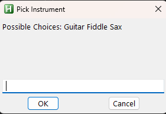
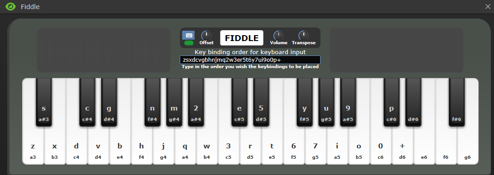

# SS13Midi2Music

Converts midi controller key presses to keyboard key presses for playing instruments in Space Station 13. Works in Goonstation.

## Download

1. Download Zip (in Code -> Download Zip)
2. `git clone https://github.com/esgameco/SS13Midi2Music.git`

## Run

Double click "main.ahk" or "main.exe" if you don't have AHK.

- Type "Fiddle" to use fiddle keys
- Type "Sax" to use sax keys
- Guitar not yet setup

## Key Binding Order

Put the key binding order for your specific instrument in the text bar at the top.

- Fiddle: zsxdcvgbhnjmq2w3er5t6y7ui9o0p+14,8k
- Sax: jmq2w3er5t6y7ui9o0p+14,8kzsxdc

## Contributing

If you know how to dynamically set labels, please send a pull request to make the code cleaner.